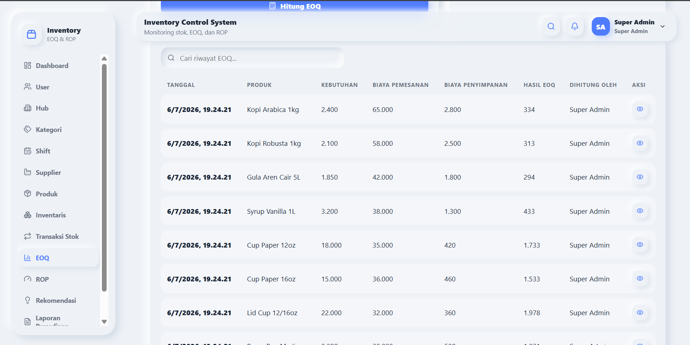
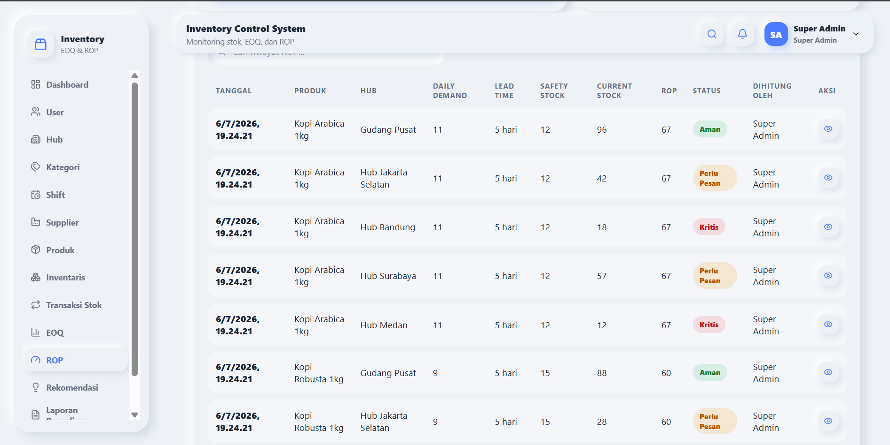

# Inventory EOQ ROP - Inventory Control System

Inventory EOQ ROP adalah sistem manajemen inventaris berbasis web untuk mengelola stok produk, supplier, gudang, transaksi stok, perhitungan EOQ, perhitungan ROP, rekomendasi pemesanan, dashboard, laporan, dan import data menggunakan Excel.

Project ini menggunakan arsitektur terpisah antara backend dan frontend:

- Backend: Laravel API
- Frontend: React + Vite
- Database: PostgreSQL

## Ringkasan Sistem

Sistem ini dirancang untuk membantu proses kontrol persediaan dengan pendekatan yang lebih terukur. Data master seperti hub, kategori, shift, supplier, dan produk menjadi dasar pengelolaan inventaris. Perubahan stok dicatat melalui transaksi masuk, keluar, dan adjustment, lalu data tersebut digunakan untuk mendukung perhitungan EOQ, ROP, serta rekomendasi pemesanan.

Dashboard dan laporan disediakan untuk memantau kondisi stok, melihat item kritis, dan mengevaluasi hasil perhitungan inventaris. Hak akses pengguna diatur berdasarkan role agar setiap pengguna hanya melihat menu dan aksi yang sesuai dengan tanggung jawabnya.

## Tech Stack

**Backend**

- Laravel API
- Laravel Sanctum
- PostgreSQL
- Laravel Excel / Maatwebsite Excel
- REST API

**Frontend**

- React
- Vite
- React Router
- Axios
- Lucide React
- Custom Neumorphism UI

## Fitur Utama

### Auth & Role

- Login akun demo.
- Logout melalui dropdown user di navbar.
- Sidebar berubah sesuai role.
- Route guard berdasarkan role.

### Master Data

- User
- Hub
- Kategori
- Shift
- Supplier
- Produk

### Inventory Management

- Inventaris produk per hub.
- Transaksi stok masuk.
- Transaksi stok keluar.
- Adjustment stok.
- Update stok otomatis berdasarkan transaksi.

### EOQ Calculation

Rumus EOQ:

```text
EOQ = sqrt((2 x D x S) / H)
```

Keterangan:

- D = kebutuhan barang dalam periode tertentu
- S = biaya pemesanan
- H = biaya penyimpanan

### ROP Calculation

Rumus ROP:

```text
ROP = (Daily Demand x Lead Time) + Safety Stock
```

Keterangan:

- Daily Demand = kebutuhan harian
- Lead Time = waktu tunggu supplier
- Safety Stock = stok pengaman

### Purchase Recommendation

- Generate rekomendasi berdasarkan stok aktual dan ROP.
- Kuantitas rekomendasi dapat menggunakan EOQ.
- Status rekomendasi: `pending`, `approved`, dan `rejected`.
- Manager Gudang dapat melakukan approve/reject rekomendasi.

### Import Excel

- Import tersedia untuk User, Hub, Kategori, Shift, Supplier, Produk, dan Transaksi Stok.
- Template Excel dapat di-download dari dalam modal import.
- Produk menggunakan `category_code` dan `supplier_code`.
- Transaksi stok menggunakan `product_code` dan `hub_code`.
- Inventaris tidak diimport langsung karena dibentuk dari transaksi stok.
- Rekomendasi tidak diimport langsung karena digenerate oleh sistem.

### UI/UX

- Login page modern split layout.
- Tema Neumorphism.
- Modal create/update.
- Detail page.
- Confirm delete.
- Toast notification.
- Pagination.
- Role-based sidebar.
- Import Excel modal.

## Role & Akses

Sistem memiliki 3 role utama:

- `super_admin`
- `admin_gudang`
- `manager_gudang`

### Super Admin

Akses:

- Dashboard
- User
- Hub
- Kategori
- Shift
- Supplier
- Produk
- Inventaris
- Transaksi Stok
- EOQ
- ROP
- Rekomendasi
- Laporan Persediaan
- Laporan EOQ & ROP

### Admin Gudang

Akses:

- Dashboard
- Supplier
- Produk
- Inventaris
- Transaksi Stok
- EOQ
- ROP
- Rekomendasi
- Laporan Persediaan
- Laporan EOQ & ROP

### Manager Gudang

Akses:

- Dashboard
- Supplier
- Produk
- Inventaris
- Transaksi Stok
- EOQ
- ROP
- Rekomendasi
- Laporan Persediaan
- Laporan EOQ & ROP

Manager Gudang fokus pada monitoring dan approve/reject rekomendasi.

Tombol aksi seperti tambah, edit, hapus, generate, approve, atau reject mengikuti hak akses role masing-masing.

## Struktur Project

```text
inventory-eoq-rop/
|-- backend/
|-- frontend/
|-- docs/
|   `-- screenshots/
`-- README.md
```

## Screenshots

Beberapa tampilan utama aplikasi ditampilkan di bawah ini. Screenshot lengkap tersedia di folder `docs/screenshots`.

### Login Page


### Dashboard


### Product Management


### EOQ Calculation



### ROP Calculation



### Purchase Recommendations


---

### Screenshot Lengkap

| No | Tampilan | File |
|---:|---|---|
| 1 | Login Page | [01-login-page.png](./docs/screenshots/01-login-page.png) |
| 2 | Dashboard | [02-dashboard.png](./docs/screenshots/02-dashboard.png) |
| 3 | Sidebar Super Admin | [03-sidebar-super-admin.png](./docs/screenshots/03-sidebar-super-admin.png) |
| 4 | Sidebar Admin Gudang | [04-sidebar-admin-gudang.png](./docs/screenshots/04-sidebar-admin-gudang.png) |
| 5 | Sidebar Manager Gudang | [05-sidebar-manager-gudang.png](./docs/screenshots/05-sidebar-manager-gudang.png) |
| 6 | Product Management | [06-products-table.png](./docs/screenshots/06-products-table.png) |
| 7 | Product Modal | [07-product-modal.png](./docs/screenshots/07-product-modal.png) |
| 8 | Product Detail | [08-product-detail.png](./docs/screenshots/08-product-detail.png) |
| 9 | Supplier Management | [09-suppliers-table.png](./docs/screenshots/09-suppliers-table.png) |
| 10 | Inventory Table | [10-inventories-table.png](./docs/screenshots/10-inventories-table.png) |
| 11 | Stock Transactions | [11-stock-transactions.png](./docs/screenshots/11-stock-transactions.png) |
| 12 | EOQ Calculation | [12-eoq-preview.png](./docs/screenshots/12-eoq-preview.png) |
| 13 | ROP Calculation | [13-rop-preview.png](./docs/screenshots/13-rop-preview.png) |
| 14 | Purchase Recommendations | [14-purchase-recommendations.png](./docs/screenshots/14-purchase-recommendations.png) |
| 15 | Inventory Report | [15-inventory-report.png](./docs/screenshots/15-inventory-report.png) |
| 16 | Import Excel Modal | [16-import-excel-modal.png](./docs/screenshots/16-import-excel-modal.png) |
| 17 | Toast Notification | [17-toast-notification.png](./docs/screenshots/17-toast-notification.png) |
| 18 | Confirm Delete | [18-confirm-delete.png](./docs/screenshots/18-confirm-delete.png) |

## Persiapan Environment

Pastikan perangkat sudah memiliki:

- PHP
- Composer
- Node.js
- npm
- PostgreSQL
- Git

## Setup Backend

Masuk ke folder backend:

```bash
cd backend
composer install
cp .env.example .env
php artisan key:generate
php artisan migrate:fresh --seed
php artisan serve --host=127.0.0.1 --port=8000
```

Untuk Windows PowerShell, gunakan command berikut saat menyalin file `.env`:

```powershell
copy .env.example .env
```

Contoh konfigurasi `.env` backend:

```env
APP_NAME="Inventory EOQ ROP"
APP_URL=http://127.0.0.1:8000

DB_CONNECTION=pgsql
DB_HOST=127.0.0.1
DB_PORT=5432
DB_DATABASE=inventory_eoq_rop
DB_USERNAME=postgres
DB_PASSWORD=your_password

FRONTEND_URL=http://localhost:5173
```

Backend berjalan di:

```text
http://127.0.0.1:8000
```

## Setup Frontend

Masuk ke folder frontend:

```bash
cd frontend
npm install
cp .env.example .env
npm run dev -- --port 5173
```

Untuk Windows PowerShell, gunakan command berikut saat menyalin file `.env`:

```powershell
copy .env.example .env
```

Contoh konfigurasi `.env` frontend:

```env
VITE_API_URL=http://127.0.0.1:8000/api
```

Frontend berjalan di:

```text
http://localhost:5173
```

## Akun Demo

**Super Admin**

```text
Email    : superadmin@inventory.test
Password : password
```

**Admin Gudang**

```text
Email    : admingudang@inventory.test
Password : password
```

**Manager Gudang**

```text
Email    : managergudang@inventory.test
Password : password
```

## Alur Penggunaan Sistem

1. Login menggunakan akun demo.
2. Kelola master data sesuai role.
3. Kelola supplier dan produk.
4. Catat transaksi stok.
5. Stok inventaris otomatis diperbarui.
6. Hitung EOQ.
7. Hitung ROP.
8. Generate rekomendasi pemesanan.
9. Manager Gudang approve/reject rekomendasi.
10. Lihat dashboard dan laporan.

## Import Excel

Langkah penggunaan import Excel:

1. Buka halaman data.
2. Klik tombol Import Excel.
3. Klik link Download Template Excel di dalam modal import.
4. Isi file template sesuai format.
5. Upload file Excel.
6. Sistem menampilkan summary hasil import.

Catatan:

- Produk menggunakan `category_code` dan `supplier_code`.
- Transaksi stok menggunakan `product_code` dan `hub_code`.
- Inventaris tidak diimport langsung karena stok dibentuk dari transaksi stok.
- Rekomendasi tidak diimport langsung karena rekomendasi dibuat dari hasil perhitungan sistem.

## Validasi Build

Backend:

```bash
php artisan route:list
```

Frontend:

```bash
npm run build
```

## Catatan Pengembangan Lanjutan

- Export laporan ke Excel atau PDF.
- Filter laporan yang lebih lengkap.
- Grafik visual dashboard.
- Riwayat approval rekomendasi yang lebih detail.
- Audit log aktivitas pengguna.
- Permission yang lebih granular.
- Unit test dan feature test backend yang lebih lengkap.
