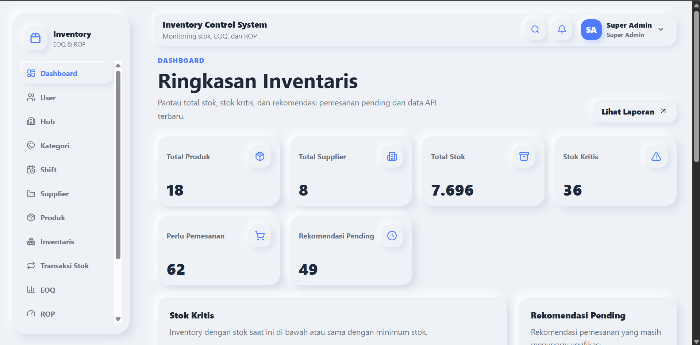
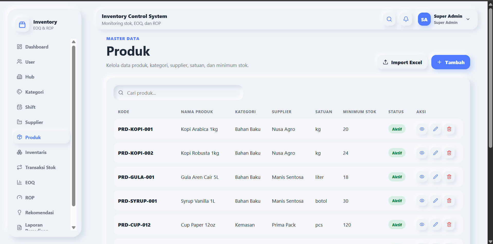
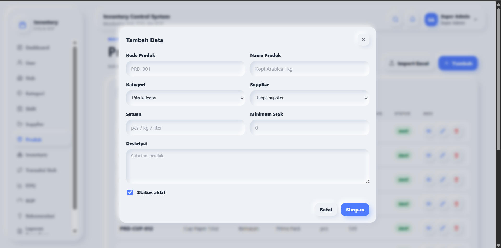
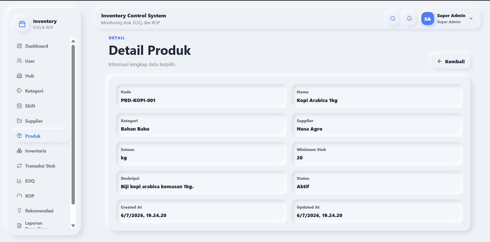
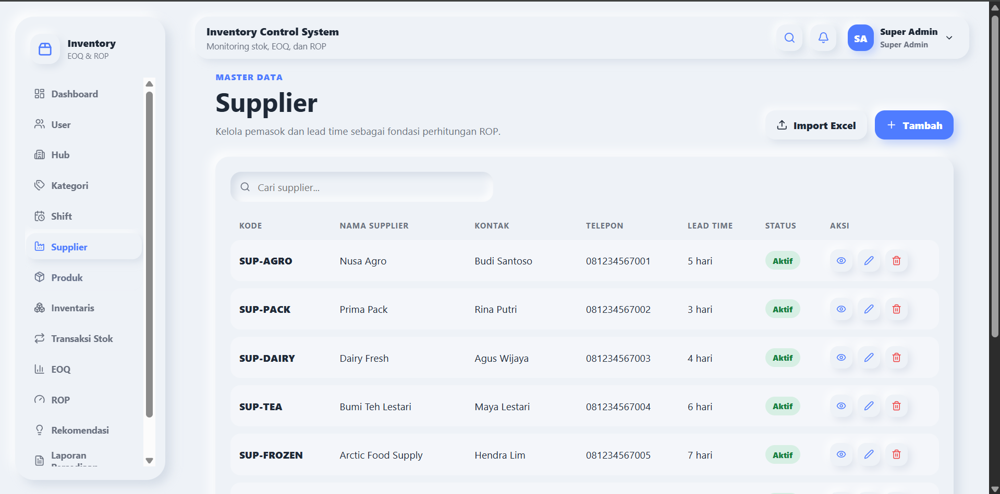
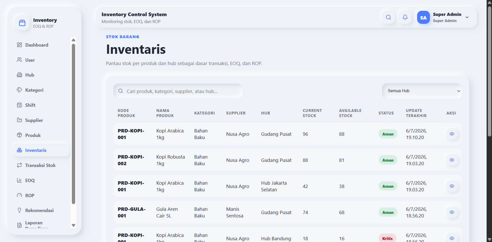
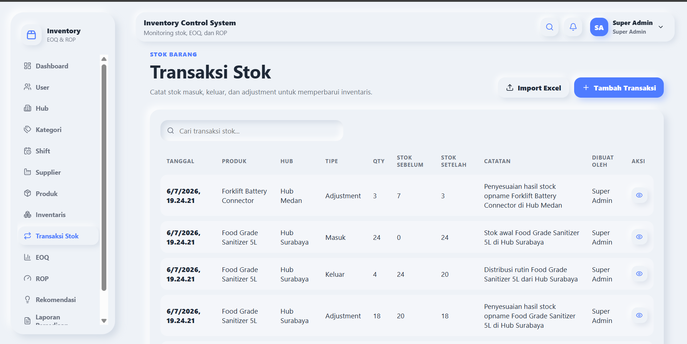
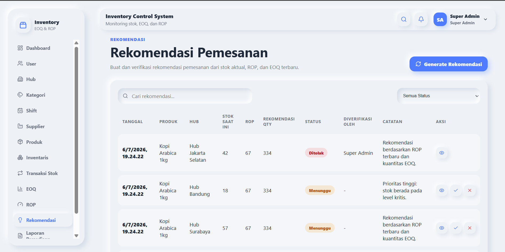
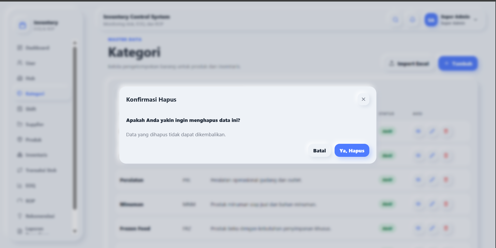

# Inventory Control System

Inventory Control System adalah aplikasi manajemen persediaan berbasis web untuk mengelola produk, supplier, data hub atau gudang, transaksi stok, pemantauan inventaris, purchase recommendation, laporan, dashboard, dan import data berbasis Excel. Economic Order Quantity (EOQ) dan Reorder Point (ROP) tersedia sebagai fitur internal stock planning calculation untuk membantu menentukan jumlah pemesanan dan waktu pemesanan ulang.

Project ini menerapkan arsitektur backend dan frontend yang terpisah:

- Backend: Laravel API
- Frontend: React + Vite
- Database: PostgreSQL

## Ringkasan Sistem

Sistem ini dikembangkan sebagai business inventory management case study yang mendukung proses kontrol persediaan secara terstruktur. Data master hub, kategori, shift, supplier, dan produk menjadi dasar pengelolaan inventaris. Setiap perubahan stok dicatat melalui transaksi masuk, keluar, atau adjustment sehingga posisi stok per hub dapat dipantau secara konsisten.

Fitur stock planning calculation menggunakan EOQ dan ROP untuk mendukung purchase recommendation berdasarkan stok aktual. Dashboard dan laporan membantu pengguna memantau kondisi persediaan serta item kritis, sedangkan role-based access memastikan menu dan tindakan tersedia sesuai tanggung jawab pengguna.

## My Role

Saya bertanggung jawab mengembangkan dan mendokumentasikan project ini sebagai portfolio case study, dengan cakupan pekerjaan:

- Menganalisis alur kontrol persediaan dan peran pengguna.
- Merancang struktur aplikasi dengan pemisahan backend dan frontend.
- Mengembangkan fitur backend API menggunakan Laravel, Sanctum, PostgreSQL, dan REST API.
- Membangun halaman frontend dan alur UI menggunakan React, Vite, Axios, React Router, serta custom UI components.
- Mengimplementasikan role-based access untuk Super Admin, Admin Gudang, dan Manager Gudang.
- Mengembangkan fitur produk, supplier, hub, inventaris, transaksi stok, stock planning calculation, rekomendasi, laporan, dan import Excel.
- Menyiapkan akun demo, screenshot, dan dokumentasi README untuk kebutuhan presentasi portfolio.

## Project Status

Project ini telah selesai dikembangkan sebagai portfolio case study dan saat ini dipelihara sebagai project portfolio publik di GitHub. Pengembangan berikutnya dapat mencakup export PDF/Excel, visualisasi dashboard yang lebih lanjut, audit log, permission yang lebih granular, automated testing, persiapan deployment, serta penyempurnaan UI/UX.

## Tech Stack

### Backend

- Laravel API
- Laravel Sanctum
- PostgreSQL
- Laravel Excel / Maatwebsite Excel
- REST API

### Frontend

- React
- Vite
- React Router
- Axios
- Lucide React
- Custom Neumorphism UI

### Tools

- Composer
- NPM
- Git
- PostgreSQL
- Excel Import Template

## Fitur Utama

### Auth & Role

- Login menggunakan akun demo.
- Logout melalui dropdown pengguna pada navbar.
- Sidebar dinamis berdasarkan role.
- Route guard dan pembatasan tindakan berdasarkan role.

### Master Data

- User
- Hub
- Kategori
- Shift
- Supplier
- Produk

### Inventory Management

- Inventaris produk per hub.
- Transaksi stok masuk.
- Transaksi stok keluar.
- Adjustment stok.
- Pembaruan stok otomatis berdasarkan transaksi.

### Stock Planning Calculation

Sistem menyediakan fitur stock planning calculation untuk membantu memperkirakan kuantitas pemesanan dan waktu pemesanan ulang.

#### Economic Order Quantity Calculation

EOQ digunakan untuk memperkirakan kuantitas pemesanan yang ekonomis berdasarkan kebutuhan barang, biaya pemesanan, dan biaya penyimpanan.

```text
EOQ = sqrt((2 x D x S) / H)
```

Keterangan:

- D = kebutuhan barang dalam periode tertentu
- S = biaya pemesanan
- H = biaya penyimpanan

#### Reorder Point Calculation

ROP digunakan untuk memperkirakan batas stok yang menjadi acuan pemesanan ulang dengan mempertimbangkan kebutuhan harian, lead time, dan safety stock.

```text
ROP = (Daily Demand x Lead Time) + Safety Stock
```

Keterangan:

- Daily Demand = kebutuhan harian
- Lead Time = waktu tunggu supplier
- Safety Stock = stok pengaman

### Purchase Recommendation

- Menghasilkan rekomendasi berdasarkan stok aktual dan ROP.
- Kuantitas rekomendasi dapat menggunakan hasil perhitungan EOQ.
- Status rekomendasi: `pending`, `approved`, dan `rejected`.
- Manager Gudang dapat menyetujui atau menolak rekomendasi.

### Import Excel

- Import tersedia untuk User, Hub, Kategori, Shift, Supplier, Produk, dan Transaksi Stok.
- Template Excel dapat diunduh melalui modal import.
- Produk menggunakan `category_code` dan `supplier_code`.
- Transaksi stok menggunakan `product_code` dan `hub_code`.
- Inventaris tidak diimport langsung karena dibentuk dari transaksi stok.
- Rekomendasi tidak diimport langsung karena dihasilkan oleh sistem.

### UI/UX

- Halaman login dengan modern split layout.
- Custom Neumorphism UI.
- Modal create/update.
- Halaman detail.
- Konfirmasi penghapusan.
- Toast notification.
- Pagination.
- Role-based sidebar.
- Modal import Excel.

## Role & Akses

Sistem memiliki tiga role utama:

- `super_admin`
- `admin_gudang`
- `manager_gudang`

### Super Admin

Akses:

- Dashboard
- User
- Hub
- Kategori
- Shift
- Supplier
- Produk
- Inventaris
- Transaksi Stok
- EOQ
- ROP
- Rekomendasi
- Laporan Persediaan
- Laporan EOQ & ROP

### Admin Gudang

Akses:

- Dashboard
- Supplier
- Produk
- Inventaris
- Transaksi Stok
- EOQ
- ROP
- Rekomendasi
- Laporan Persediaan
- Laporan EOQ & ROP

### Manager Gudang

Akses:

- Dashboard
- Supplier
- Produk
- Inventaris
- Transaksi Stok
- EOQ
- ROP
- Rekomendasi
- Laporan Persediaan
- Laporan EOQ & ROP

Manager Gudang berfokus pada pemantauan persediaan serta persetujuan atau penolakan rekomendasi.

Tombol aksi seperti tambah, edit, hapus, generate, approve, atau reject mengikuti hak akses setiap role.

## Struktur Project

```text
inventory-control-system/
|-- backend/
|-- frontend/
|-- docs/
|   `-- screenshots/
`-- README.md
```

## Screenshots

Berikut adalah tampilan fitur utama dalam Inventory Control System.

### Login Page


### Dashboard Overview



### Sidebar Super Admin


### Sidebar Admin Gudang


### Sidebar Manager Gudang


### Product Management



### Product Form Modal



### Product Detail Page



### Supplier Management



### Inventory List



### Stock Transactions



### EOQ Calculation


### ROP Calculation


### Purchase Recommendations



### Inventory Report


### Import Excel Modal


### Toast Notification


### Delete Confirmation Modal



## Persiapan Environment

Pastikan perangkat telah memiliki:

- PHP
- Composer
- Node.js
- NPM
- PostgreSQL
- Git

## Setup Backend

Masuk ke folder backend, instal dependency, siapkan environment, lalu jalankan migrasi dan server lokal:

```bash
cd backend
composer install
cp .env.example .env
php artisan key:generate
php artisan migrate:fresh --seed
php artisan serve --host=127.0.0.1 --port=8000
```

Untuk Windows PowerShell, gunakan perintah berikut saat menyalin file `.env`:

```powershell
copy .env.example .env
```

Contoh konfigurasi `.env` backend:

```env
APP_NAME="Inventory Control System"
APP_URL=http://127.0.0.1:8000

DB_CONNECTION=pgsql
DB_HOST=127.0.0.1
DB_PORT=5432
DB_DATABASE=inventory_control_system
DB_USERNAME=postgres
DB_PASSWORD=your_password

FRONTEND_URL=http://localhost:5173
```

Backend berjalan di:

```text
http://127.0.0.1:8000
```

## Setup Frontend

Masuk ke folder frontend, instal dependency, siapkan environment, lalu jalankan development server:

```bash
cd frontend
npm install
cp .env.example .env
npm run dev -- --port 5173
```

Untuk Windows PowerShell, gunakan perintah berikut saat menyalin file `.env`:

```powershell
copy .env.example .env
```

Contoh konfigurasi `.env` frontend:

```env
VITE_API_URL=http://127.0.0.1:8000/api
```

Frontend berjalan di:

```text
http://localhost:5173
```

## Akun Demo

### Super Admin

```text
Email    : superadmin@inventory.test
Password : password
```

### Admin Gudang

```text
Email    : admingudang@inventory.test
Password : password
```

### Manager Gudang

```text
Email    : managergudang@inventory.test
Password : password
```

## Alur Penggunaan Sistem

1. Login menggunakan akun demo.
2. Kelola master data sesuai role.
3. Kelola supplier dan produk.
4. Catat transaksi stok.
5. Sistem memperbarui stok inventaris secara otomatis.
6. Jalankan perhitungan EOQ.
7. Jalankan perhitungan ROP.
8. Generate rekomendasi pemesanan.
9. Manager Gudang menyetujui atau menolak rekomendasi.
10. Pantau dashboard dan laporan.

## Import Excel

Langkah penggunaan import Excel:

1. Buka halaman data yang mendukung import.
2. Klik tombol Import Excel.
3. Klik tautan Download Template Excel di dalam modal import.
4. Isi file template sesuai format.
5. Upload file Excel.
6. Tinjau ringkasan hasil import yang ditampilkan sistem.

Catatan:

- Produk menggunakan `category_code` dan `supplier_code`.
- Transaksi stok menggunakan `product_code` dan `hub_code`.
- Inventaris tidak diimport langsung karena stok dibentuk dari transaksi stok.
- Rekomendasi tidak diimport langsung karena dibuat dari hasil perhitungan sistem.

## Validasi Build

Validasi daftar route backend:

```bash
php artisan route:list
```

Validasi production build frontend:

```bash
npm run build
```

## Catatan Pengembangan Lanjutan

- Export laporan ke Excel atau PDF.
- Filter laporan yang lebih lengkap.
- Grafik dashboard yang lebih informatif.
- Riwayat approval rekomendasi yang lebih detail.
- Audit log aktivitas pengguna.
- Permission yang lebih granular.
- Unit test dan feature test backend yang lebih lengkap.
- Automated testing untuk frontend.
- Persiapan deployment.
- Penyempurnaan UI/UX.
